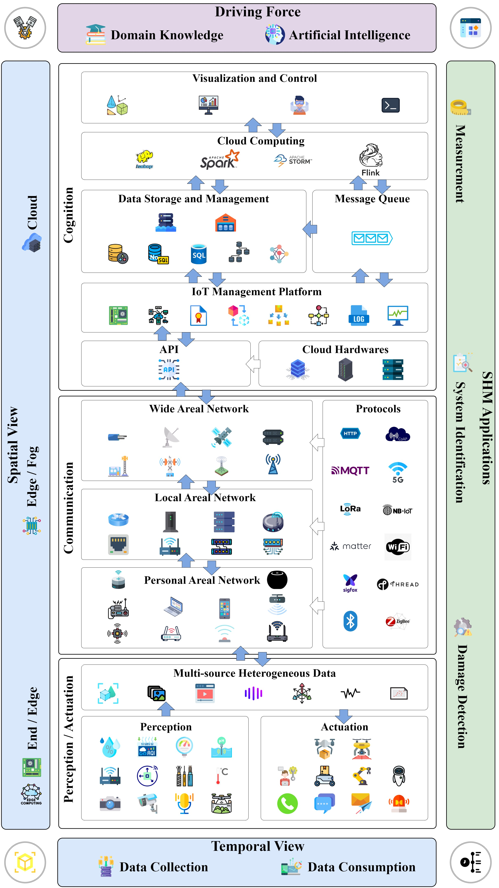
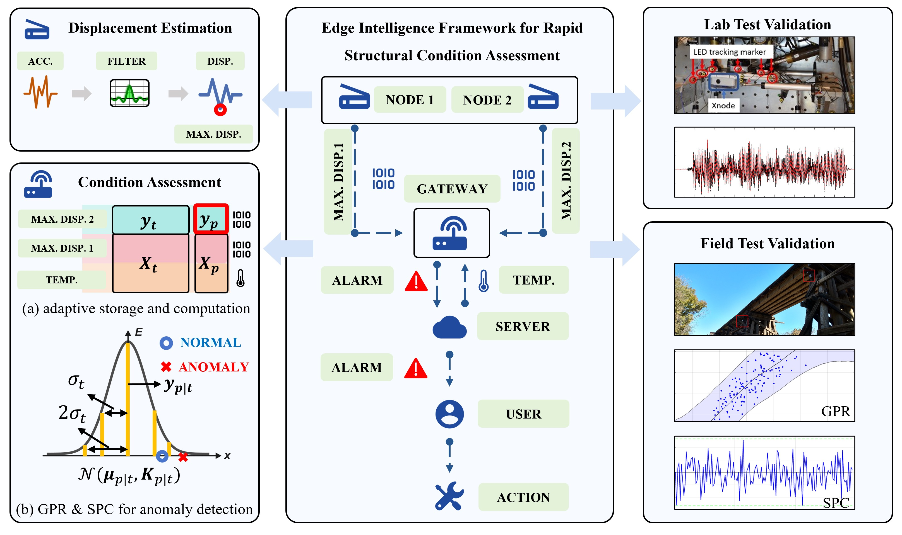

# 🏛  III Research

## 3.0 Research Roadmap

### 3.0.1 Overview
- Hardware & Software Framework 
- Algorithm Development & Implementation

### 3.0.2
- Infrastructure - IoT
- Perspective - Distributed Intelligence (AI)
- Application (SHM view) - Structural Health Monitoring (measurement, system identification, damage analysis(detection, localization, evaluation, prediction, control)); (Math View) - Classification, Regression, Clustering, Optimization

### 3.0.3 
- Novelty - Multi Agent System
- Challenge - Real-time, Energy-efficient, Scalable, Multi-modal, Multi-scale, Multi-source, Multi-objective

## 3.1 Literature Review - Computing in IoT-based SHM 

- Paper Writing - Github Repo - [Paper - Computing in IoT-based Structural Health Monitoring](https://github.com/Shuaiwen-Cui/Paper-Computing_in_IoT-based_SHM.git)
  - Abstract - [✅]
  - Introduction - [✅]
  - Data Infrastructure
    - 2.1 Data Infrastructure Architecture - [✅]
    - 2.2 Perception - [✅]
    - 2.3 Actuation - [✅]
    - 2.4 Network and Communication - [✅]
    - 2.5 Computing and Cognition - [✅]
  - Temporal-Spatial Perspective
  - Driving Force Perspective
  - Application Perspective
  - Discussion
    - Challenges
    - Potential Enablers
  - Conclusions
- Coauthor Writing
  - Feedback From Fu Hao [✅]
  - Feedback From Dr Shen [✅]
  - Feedback From Yu Xiao [✅]
  - Feedback From Prof Fu [ ]

## 3.2 Smart Adaptive Triggering Mechanism

### 3.2.1 Overview
[digital twin enabled feedback loop control for smart adaptive triggering mechanism in structural health monitoring]
- Feedback Loop Optimization and Control - Big Picture (Digital Twin Perspective)
- environment = excitation + physical and cyber structures + response
- (1) system = triggering mechanism
- (2) estimator = precision rstimator (CNN) + tecall rstimator (DNN)
- (3) optimizer/controller = Bayesian Optimization

### 3.2.2 Challenges & Novelties
- [x] Type I and Type II Error - F-beta Score Guided Optimization
- [x] Imbalanced Data - Event of Interest (static) + Event of Non-interest (dynamic)
- [x] Partially Observability - Training DNN for Recall estimation using varing level noises
- [x] Expensive Cost - Bayesian Optimization
- [ ] Comparison - Particle Swarm Optimization / Grid Search

3-types

### 3.2.3 Algorithm Development

### 3.2.4 Algorithm Implementation

## 3.3 Online Displacement Estimation and Gaussian Process Regression and Stochastic Process Control [✅]

- Displacement Estimation Theory [✅]
  - Refer to Fernando's Paper

- Displacement Implementation [✅]
  - Transplant from Tu's Code to the new version

- Gaussian Process Regression Theory [✅]
  - [Gaussian Process - D2L](https://d2l.ai/chapter_gaussian-processes/index.html)

- Gaussian Process Regression Implementation [✅]
  - CMSIS
  - Mind the Error

## 3.4 Federated Learning