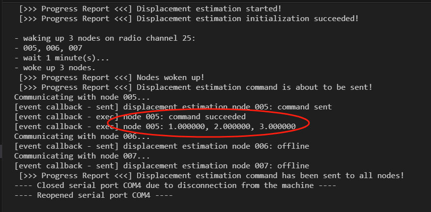
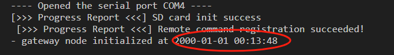
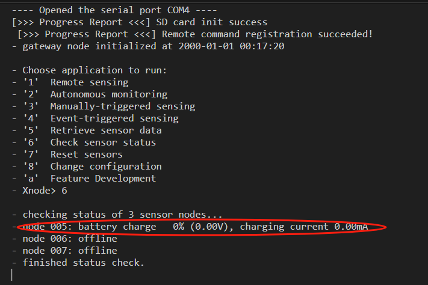
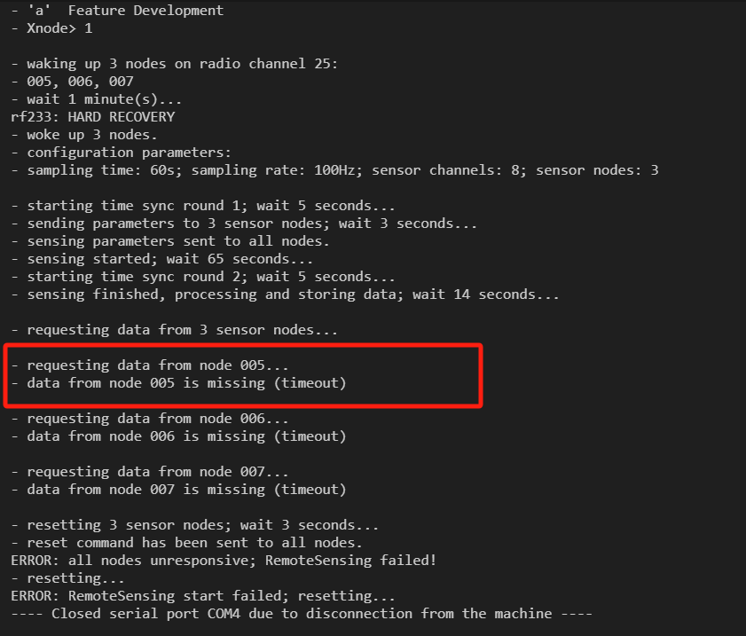
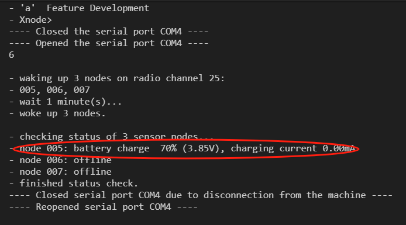
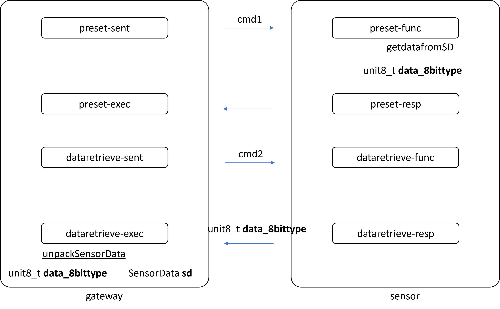
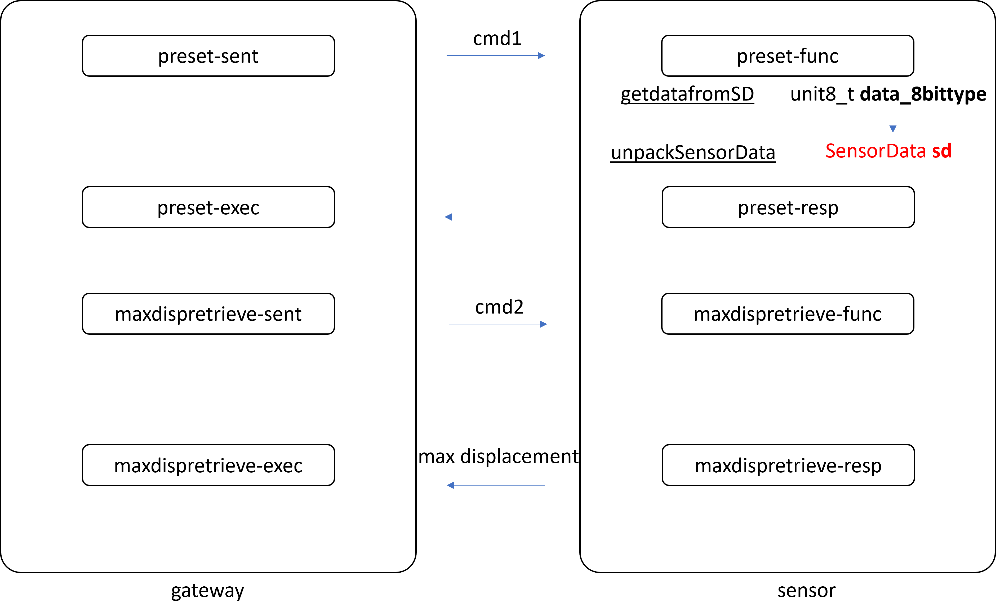

## 🔟 Octomber
### 🚀 Oct 26
> Weekly Meeting
- Facade Inspection
  - Hardware Preparation
    - Wireless Sensing
    - Wired Sensing
      - Power Supply?
  - Operation Guide
    - What to carry?
    - How to knock?
- GPRSPC Computing Issues
  - finish it first
  - disp est & remote cmd
  - Numerical Errors
  - Possible Solutions:
    - Scaling
    - Bias
    - Initial Computing on PC
      - Inverse of Ktt (noised)
- PID Test
  - to integrated within SATM
  - maybe GPR also
  - then transit to RL

> Tunnel Deployment Meeting
- AWS server - EC2 Server
- Long term test

## 1️⃣1️⃣ November
### 🚀 Nov 2

### 🚀 Nov 9

### 🚀 Nov 16

### 🚀 Nov 23
> Weekly Meeting
- Try RL

> Tunnel Deployment Meeting
- to try
  - antenna
  - channel number
  - distance > 1 meter

- looks the xnode did not read the IP address correctly ...

### 🚀 Nov 30
> SATM
- conventional optimization methods
  - optimal threshold, duration
- Dr Meng Dataset 

- measurement error

- Xnode GPR - speed up


### 🚀 Dec 05
- FL
- Data Anomaly Detection

> How to deploy the algo to the Xnode?
(1) Tarutal's Algo
(2) Fu Hao - MCU Programming
(3) Xnode 


(1) Python -> C (Jan)
(2) C - Xnode (Feb)
FL later
(3) Federated Learning

weekly / biweekly meeting

### 🚀 Dec 07
> Xnode Debugging
- power
- channel

> Xnode Displacement Estimation Function Transplantation
- Data Structure

### 🚀 Dec 12 - Edge intelligence for Xnodes
- Fu Hao' Code
  - env building up
  - calculate num of parameters

### 🚀 Dec 14 - Weekly Meeting
> Xnode
- Code Versions
  - (1) Displacement Estimation & Live Streaming (v13)
  - (2) Remote Sensing (no displacement estimation no 4G) (v15)
  - (3) 4G 
- Connection Between Leaf Nodes and Gateway
  - (1) version (1) OK (sometimes ok sometimes not)
  - (2) version (2) OK (sometimes ok sometimes not)
  - (3) version (3) ? (the log looks fine but never succeeded)
- How to merge the features? - GPRSPC
  - (1) Displacement Estimation
  - (2) Data Retrieving 
  - (3) 4G function to get temperature data
- Currently Base Version - non disp est non 4G version
  - Issue: the connection is not stable - sometimes no feedback
- Work In Progress
  - (1) Data Structure
  - (2) Data to retrieve
  - (3) Computing ~ Displacement Estimation Version V13
    - max disp is calculated on leaf node
    - only max disp is retrieved

### 🚀 Dec 14 - Tunnel Deployment Meeting
> mqtt - paho

### 🚀 Dec 15 - Meeting
remote command
CNN network

to Dhruv

> Share the C code ~ two weeks

> CNN network

### 🚀 Dec 21 - Tunnel Deployment Meeting
> Test Log
> 4G - OK
> Synchronization OK
> RemoteSensing - not OK
> Check Status - not OK

### 🚀 Dec 21 - Weekly Meeting

Get Max Disp Data

### 🚀 Dec 28 - Weekly Meeting

### 🚀 Dec 28 - Tunnel Deployment Meeting

## 2️⃣0️⃣2️⃣4️⃣ January

### 🚀 Jan 08 - Weekly Meeting
> Tried to print out the displacement, not succeeded
- Leaf Node Issues
  - [ ] The displacement values are all zero
  - [ ] zero gap between two numbers
  - [ ] not enough print line length: currently 120
  - [ ] spikes: not sure reason
- Transmission Issues
  - [ ] Received data inconsistent with the sent data
    - [ ] zero gap
    - [ ] spikes

> Matlab Code Check
- [ ] Detrend - Slope & Offset
- [ ] Scale Factor - 1/fs^2

> Displacement Estimation Evaluation
- [ ] Removed the displacement printout & Only use the max displacement for checking
- [ ] On Xnode, the scale factor is applied (fs^2) 
- [ ] Detrending is not applied yet

> Takeaway
1. Unit Test
2. Two Days

### Meeting With Tu & Kirill

slides to show the progress

>I GPR SPC
- [ ] MATLAB results VS Xnode results - inconsistent
  - filter - the same
  - scale ?
  - drift ?
- [ ] Remote Command
- [ ] 4G function transplant 
- [ ] add disp to existing structure

>II Edge Intelligence
- Keil 5?
- CMSIS 5?
- how to add/update new lib?
- all declaration must before execution - example load data from csv, with no dim info, how to determine the size  of the array?

>WT-ICA-VMD
CMSIS DSP advanced functions?


CMSIS 5? 
DSP Functions

### 🚀 Jan 12 - Meeting for Xnode Dev

#### Info
Time: 12 Jan 2021, 11:00 - 12:00, Singapore Time
Attendees: Prof Fu, Dr Tu Hoang, Dr Krill Mechitov, Me.
Meeting Link: https://ntu-sg.zoom.us/j/2222519483?pwd=bTJzVmltZlBndlk1emtsZVdtMWdqUT09
Meeting ID: 2222519483
Passcode: 996878

#### Agenda - Question List

##### For General Purpose Development
- Developer Documentation? Other references?
- IDE
  - KEIL MDK 5 ? (looks more convenient to import new libs)
  - VSCode? (copilot + git)
- CMSIS LIB
  - Current Version - CMSIS 4, anyway to update to CMSIS 5?
  - Influence on existing code?
- Desirable Features Scattered in Different Versions
  - Live Streaming
  - Radio Test
  - Remote Sensing *
  - Cellular Network

##### For Project Oriented Development - GPR SPC
> Disp Estimation

> Data Retrieving

> GPR Computing

##### For Project Oriented Development - Sudden Damage Detection
> Transformations
- Discrete Wavelet Transform (DWT)
- Independent Component Analysis (ICA)
- Variational Mode Decomposition (VMD)

- No off-the-shelf lib for DWT, ICA, VMD

> Large Volume Data Processing

##### takeaway

filter - blockwise

remote command - utils.c

merge functions - 4G based /  add 4G to v15

average peak

send code to Tu

send src code to Tu

import lib to Keil, into installation directory, replace. lib / header file

### 🚀 Jan 22 - Weekly Meeting

Since Last Friday

> Meeting with Dhruv - NN implementation on Xnode for anomaly detection

> NN
- Fu Hao's Code - comments -> english -> Dhruv

> Environment Setup for STM32 

- HW: STM32 
- SW: STM32CubeMX + Keil MDK 5

> Disp Estimation - Blockwise -> Tu

> Remote Command
- follow utility.c first to check acknowledgement
- then do disp retrieve implementation

### 🚀 Jan 29 - Weekly Meeting
- [x] Remote Command Test - OK


- Incorrect time


<!-- - snoozealarm commented out in app_sensor.c



- keep snoozealarm in app_sensor.c and util_wakeup in other scripts
 -->

- DataRetrieval
  - 1. Displacement Estimation
  - 2. Max Displacement Retrieval using Remote Command [*]
  - 3. Gaussian Process Regression for Anomaly Detection

- MaxDisp Retrieval Plan
  - 1. Displacement Estimation
    - SD Card: Path: \MaxDisp
    - "Max Disp: CH01: %.6f\tCH02: %.6f\tCH03: %.6f\r\n"
  - 2. Max Displacement Retrieval using Remote Command
    - Only take the latest one
    - Save to SD Card
  - 3. Gaussian Process Regression for Anomaly Detection
    - Load GPR Model from SD Card
    - Read Value to check from SD Card
    - Do GPR for Anomaly Detection

### 🚀 Feb 05 - Weekly Meeting
- [ ] SD/NandFlash reset - it works
```bash
-------------------------------------------------------------------------------
- Embedor Technologies Xnode Smart Sensor
- * Base Version: 2.6
- * MCU: LPC4357
- * Core: ARM Cortex-M4F
- * OS: FreeRTOS 10.2.1
- * Sensor: 24-bit acceleration
- * Core freq: 120 MHz
- * >>> Feature Development <<<
-------------------------------------------------------------------------------

[>>> Progress Report <<<] SD card init success
 [>>> Progress Report <<<] Remote command registration succeeded!
- gateway node initialized at 2000-01-01 00:10:32

- Choose application to run:
- '1'  Remote sensing
- '2'  Autonomous monitoring
- '3'  Manually-triggered sensing
- '4'  Event-triggered sensing
- '5'  Retrieve sensor data
- '6'  Check sensor status
- '7'  Reset sensors
- '8'  Change configuration
- 'a'  Feature Development
- Xnode> a

- Choose action:
- 'a'  Infrastructure Features
- 'b'  Available Features
- 'c'  In-development Features
- 'd'  Return
- Xnode> c

[>>> Progress Report <<<] Option Selected - in-development features

- Choose action from in-development features:
- 'a'  test
- 'b'  remote command test - for displacement estimation
- 'c'  disp estimation in development
- 'd'  Return
- Xnode> c
Disp estimation test.
- preparing data
yaffs: yaffs: yaffs_ll_init()
yaffs: yaffs2_scan_backwards starts  intstartblk 1 intendblk 900...
yaffs: yaffs2_scan_backwards block 733 is bad
yaffs: 0 blocks to be sorted...
yaffs: ...done
yaffs: yaffs2_scan_backwards ends
yaffs: Block summary
yaffs: 0 blocks have illegal states
yaffs: Unknown 0 blocks
yaffs: Needs scan 0 blocks
yaffs: Scanning 0 blocks
yaffs: Empty 899 blocks
yaffs: Allocating 0 blocks
yaffs: Full 0 blocks
yaffs: Dirty 0 blocks
yaffs: Checkpoint 0 blocks
yaffs: Collecting 0 blocks
yaffs: Dead 1 blocks
yaffs: yaffs: yaffs_guts_initialise() done.
LIST:
----: lost+found
/nand/lost+found----
```

- [ ] DataRetrieval Modification





- [ ] Remote Command Implementation
  - Displacement Estimation - transplantation
  - Remote Command 1 : Displacement Estimation on leaf nodes
  - Remote Command 2 : Max Displacement Retrieval to gateway node
  - downstream calculation: GPR for anomaly detection
- [ ] unit_8 data_8bittype -> SensorData sd

### 🚀 Feb 6 - Sensor Prototyping

### 🚀 Feb 8 - Remote Command for Displacement Estimation
- unpack data on leaf node
- time out
- time delay?
- LED - not working

- DataRetrieval
- DisplacementEstimation
  - 4 steps

- Data Structure after transmission consistent or not?
- Remotecommand_done - position? 

### 🚀 Feb 19 - Weekly Meeting

- **Tasks on Agenda**
  - Reomote Command for Displacement Estimation
    - LED time counting
  - Qualifying Exam (**Time-Sensitive**)
  - Conference - PROTECT2024 (**Time-Sensitive**)
    - Extended Abstract Submission - March 1
    - Full Paper Submission - March 15

- **Study Focuses**
  - Embedded System Development
    - STM32-based
      - Recommanded by Fu Hao
      - Many resources available for study
    - DSP Implementation
      - CMSIS-DSP
    - Neural Network Implementation
      - Google Net Implementation
        - Setup the dev-kit for Dhruv
        - Raw Data - (STFT - CNN)
  - Digital Signal Processing
    - **Wavelet Transform**
    - **Independent Component Analysis**
    - **Variational Mode Decomposition**
    - Empirical Mode Decomposition
  - Reinforcement Learning
    - Basics
    - Markov Decision Process (MDP)
    - Q-Learning
    - ...

- **PhD Study Topic**
  - Proposed Topic
    - Distributed Intelligence Enabling IoT Framework for Structural Health Monitoring
  - Problem
    - Too generic
    - Need to narrow down the scope
  - Idea
    - Inspiration: Reinforcement Learning: Agent - Environment
    - IoT-WSN: **multi-agent system**
    - Things to try: Federated Learning, Reinforcement Learning, Game Theory, GNN (Graph Neural Network) 

### 🚀 Feb 20 - Sensor Prototype Meeting

May 28  --- Make a presentation at EMI 2024, Chicago.


Tasks: 
1.	CNN for data anomaly classification: [low accuracy]   -- 1 month in Mar
Compile and implement CNN in Xnodes for data anomaly classification 
1.1	CNN code in STM32 [Fu Hao completed CNN & STFT in C in STM32]  
1.2	CNN code in Xnode for inference [??]; CNN code in computer for training [easy]

2.	GoogleNet with compression for classification: [high accuracy]   -- 2 months in April & May
Done for simulation and python (Tarutal’s paper)
Not yet: Xnode and C language
2.1	GoogleNet with compression & Model in Python in PC [Tarutal done]
2.2	GoogleNet with compression in C language in PC  [3 weeks]
2.3	GoogleNet/C in STM32? & Training in PC and Inference in STM32  [2 weeks]
2.4	GoogleNet/C in Xnode [2 weeks]
2.5	GoogleNet/C results comparison with Tartual’s paper [1 week – 3 slides]


### 🚀 Feb 23 - Meeting with Prof Fu
- [ ] None-task, Before, remotecommand_done, test ok, white LED observed
- [ ] None-task, After, remotecommand_done, test not ok, white LED not observed, all zero
- [ ] None-task, After, "static removed", remotecommand_done, test not ok, all zero - nothing to do with static
- [ ] Task

### 🚀 March 18 - Weekly Meeting
- [x] Algorithm Integration: Displacement Estimation + Remote Command Data Transmission + Gaussian Process Regression + Stochastic Process Control
- [ ] Displacement Estimation to be improved
- [ ] STM32-based Development
  - [ ] framework build up
  - [ ] displacement estimation
  - [ ] sensor prototyping
  - [ ] cnn / googlenet 