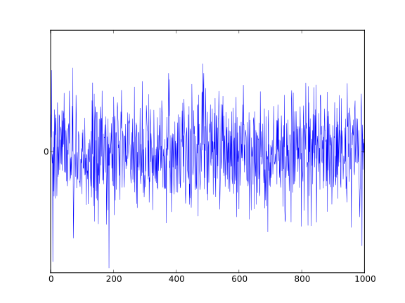

# Weekly Report Jun 17, 2024

SATM: BAYESIAN OPTIMIZATION:

**PRETRAINING ON PC** AND **FINE-TUNING ON EDGE**

Important Assumption: the data distribution on edge is close to our assumed  distribution on PC.

## Pretraining on PC

### balanced data -> imbalanced data

to consider the a priori of data distribution

### unweighted evaluation -> weighted evaluation

the events of interest are rare, so we need to consider the weights of the classes.

### bonus factor to desired situations

rather than using a punishment term, we use a bonus factor to encourage the model to achieve the desired situations. For example, when recall > 0.9, precision > 0.9, we give a bonus factor to the F-beta score. So, the theoretical upper bound of the F-beta score is 1*bonus_factor.

## Fine-tuning on Edge (on going)

### System: threshold & duration -> precision & recall -> F-beta score

precision - can be calculated

recall - cannot be calculated directly

the key is to estimate the **recall**, so we can calculate the F-beta score.

#### Possible solution 1

construct the GP model for **threshold & duration -> recall**

then input threshold & duration to the GP model to get the recall. Plus the real precision, we can calculate the F-beta score.

Q: This GP model stands for our assumption data distribution in the pre-training stage. How to update the GP model for recall while on edge?

#### Possible solution 2 （idea of transfer learning / a priori）

study the relationship between the **white noise features (avg, std) & threshold & duration** and the **recall** on edge.

GP: noise strength, threshold, duration -> recall

USE this as **a priori** knowledge to estimate the recall.

[x] pure NN method

[x] transfer learning - online learning