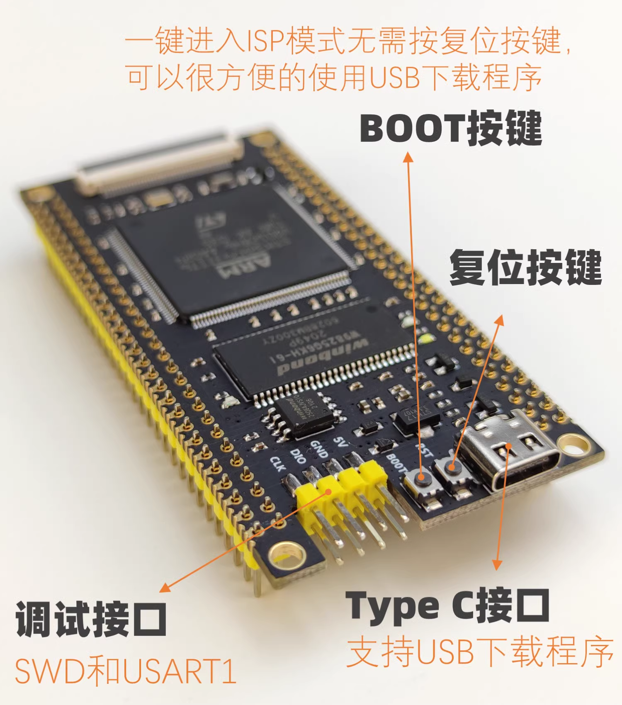

# Weekly Report Jun 01 2024

SENSOR PROTOTYPING - STM32

**KEY FEATURES DEVELOPED:**

EXTERNAL RAM (SDRAM) + MEMORY CONTROL FOR SDRAM

**PROJECT STRUCTURE:**

H723 

H743 32 EXTERNAL RAM

STM32H743

FANKE

[TOP]

- Application

- Middleware

- Board Support Package (BSP)

- HAL & LL Drivers from STM32 official

- Hardware

[BOTTOM]

**STM32 DEV KIT (FANKE STM32H743) AVAILABLE FEATURES:**
- LED*
- Serial Communication (Input & Output, variable length)*
- FMC (Flexible Memory Controller) - for memory interfacing
- SDRAM (External RAM,32MB)*
- Memory Management for SDRAM*
- SDMMC （Secure Digital MultiMedia Card）
- SD Card*
- FATFS (File System)
- CMSIS-DSP
- CMSIS-NN

**FEATURES TO BE ADDED IN FUTURE:**
- ADC
- ACCELEROMETER
- COMMUNICATION COMPONENTS (WIFI (ESP8266), 4/5G MODE) AT COMMAND
- RTOS (FREERTOS)
- BATTERY
- POWER MANAGEMENT
- NAND FLASH
- GPS
- CAMERA

