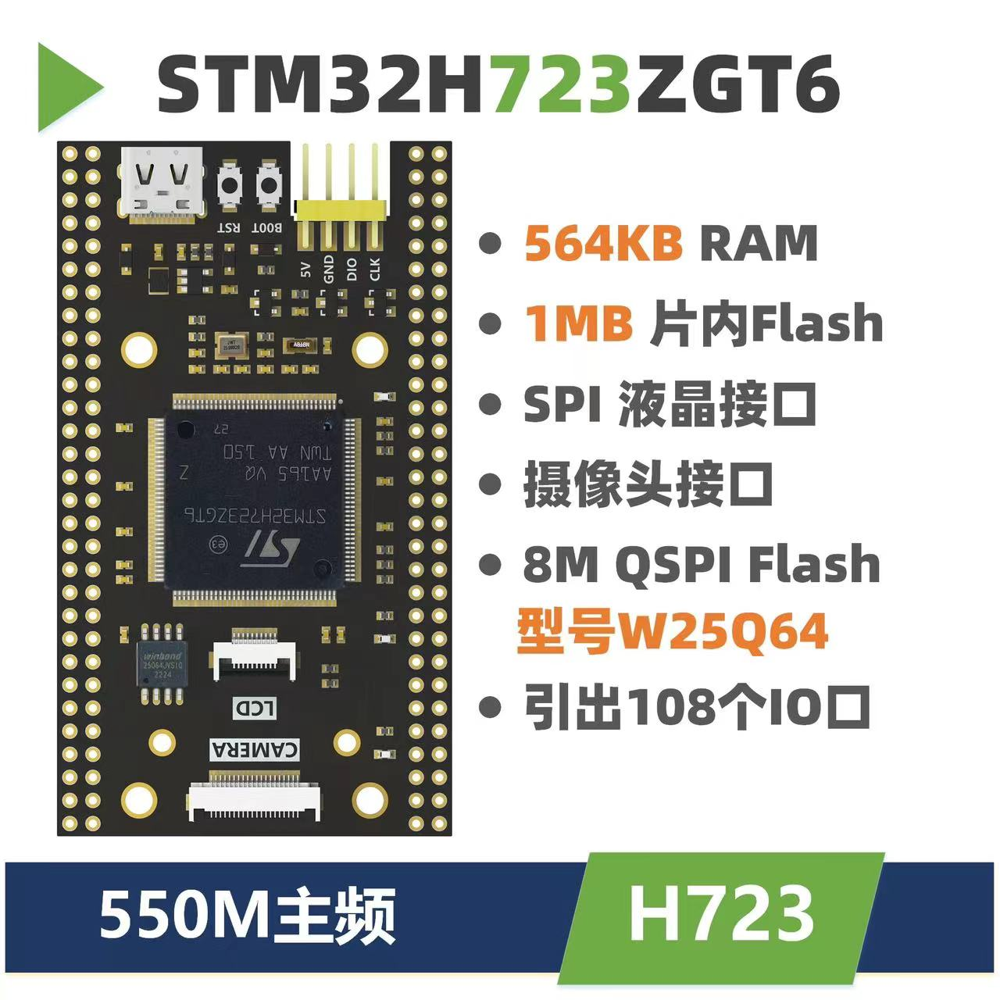
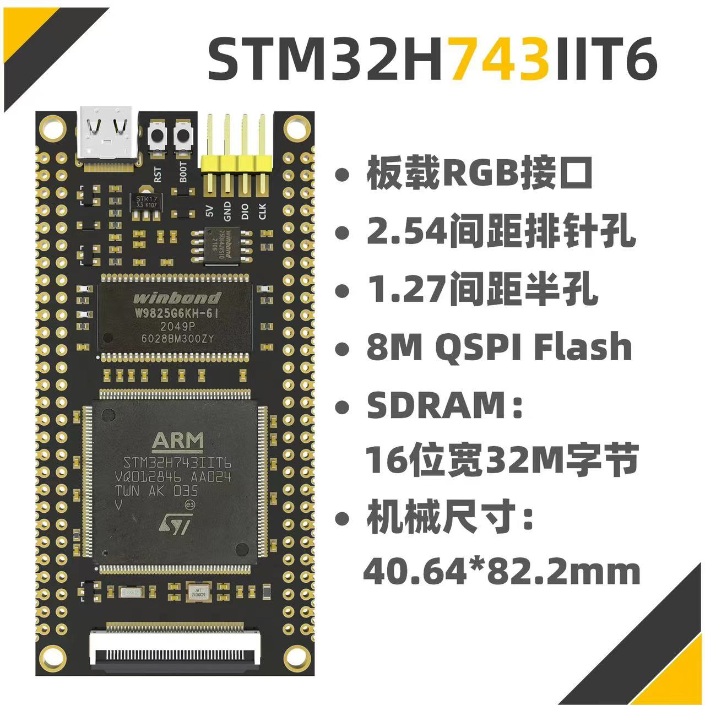
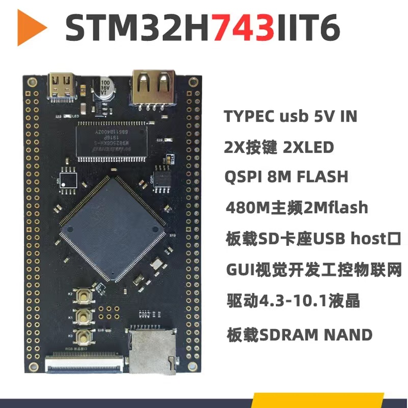
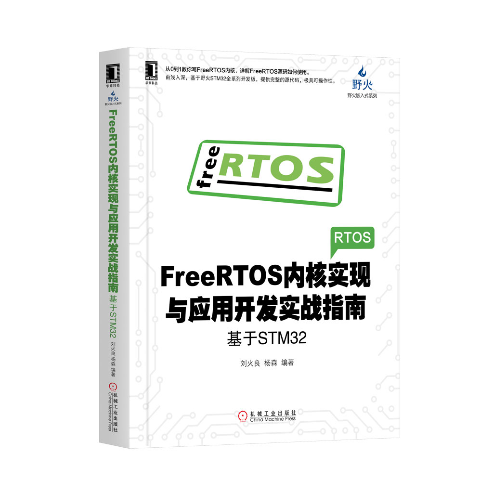

[I STM32 DEV]
- FANKE

**no enough ram**

- not responding after soldering the pins
- two more boards on the way

- GEEKSTM32

SETTINGUP:
- [x] LED
- [x] KEY
- [x] USART - OUTPUT OK; INPUT BUGGY
- [x] SDRAM
- [x] SD CARD
- [x] DSP
- [x] NN

- official codes
- buggy
- especially the sdram

 adi

[II XNODE]

- CMSIS DSP updated
- CMSIS NN added
- TODO: test functions
- C99 standard used otherwise errors
- usbscore.c modified

[ONBOARD AI IMPLEMENTATION]
- STM32: X-CUBE-AI

[SUDDEN DAMAGE DETECTION - PROTECT2024]
MEETING THIS AFTERNOON? 3:30PM
