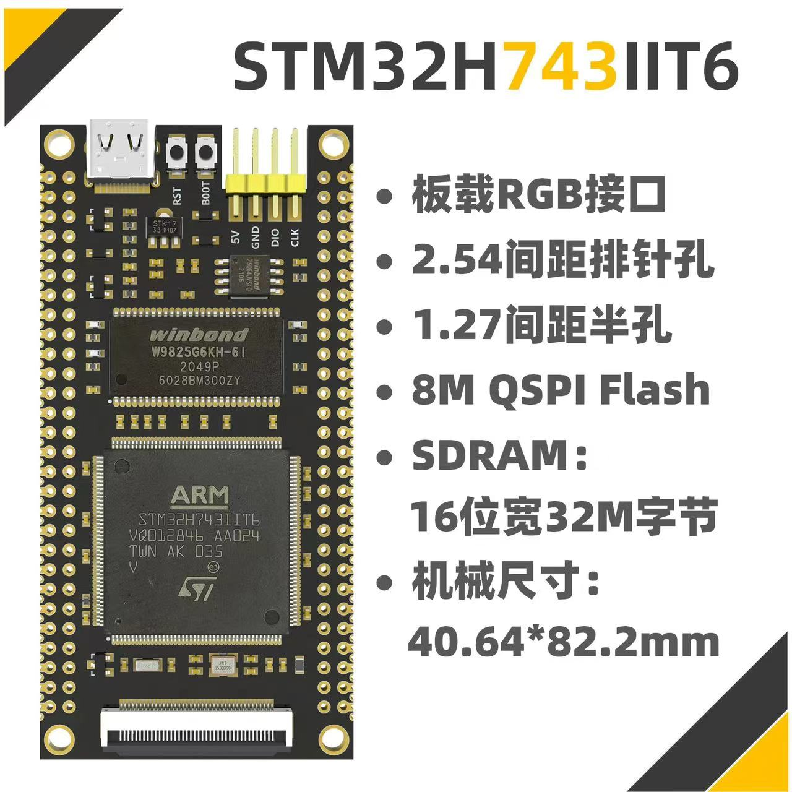

# MCU-NODE DEVELOPMENT

## Main Control Board ✅

### Software Infrastructure
- [x] LED - Status Indication
- [x] USART - Serial Communication
- [x] FMC-SDRAM - External Memory
  - [x] SDRAM IO
  - [x] Memory Management
- [x] SDMMC-SD Card - Large Volume Storage
  - [x] SDIO - SD Card R/W Interface
  - [x] **FATFS - File System [UPDATED]** 
    - **Hardware Connecting Issues**
    - **Software Compatibility Issues**
- [x] **CMSIS DSP [UPDATED]**
- [x] **CMSIS NN [UPDATED]**

Now, it's ready for edge computing. Peripherals to be added in future.

## Peripheral Components

### Sensing
- Accelerometer
  - [ ] **ADXL362**
  - [ ] **ADXL355**  

### Communication
- Internet Connection
  - [ ] WiFi
  - [ ] Cellular
- Radio Communication
  - [ ] NRF24L01 2.4GHz

### Interfacing
- Status Indication
  - [ ] RGB LED
  - [ ] OLED Display
- User Input
  - [ ] Buttons

# X-CUBE-AI - FOR SATM/ PROTECT2024
- Model imported into project
- studing how to use the generatd functions in application

# PROTECT2024 -  SUDDEN DAMAGE DETECTION USING EDGE INTELLIGENCE
- Data - PC simulation?
- ~~VMD - donoising~~
- WT - spike detection
- ICA - denoising & localization [in consistency]
- ~~shapelet transform - feature extraction & explanation~~
- NN [coding]