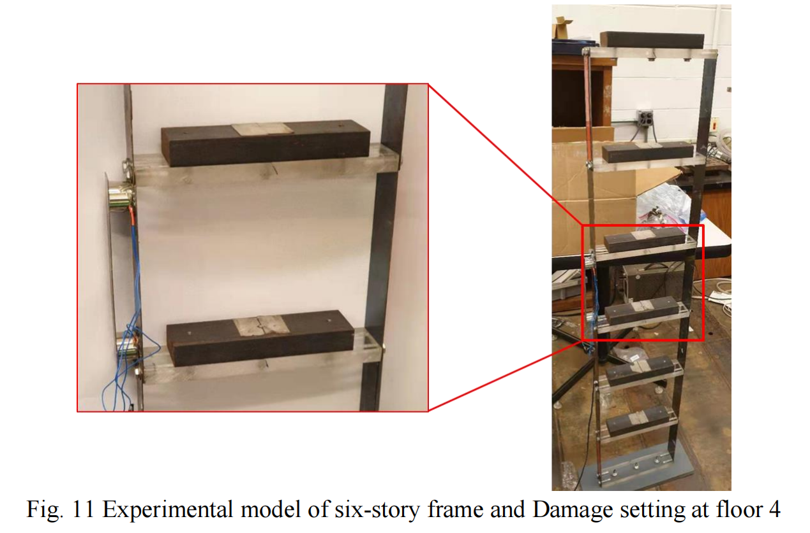
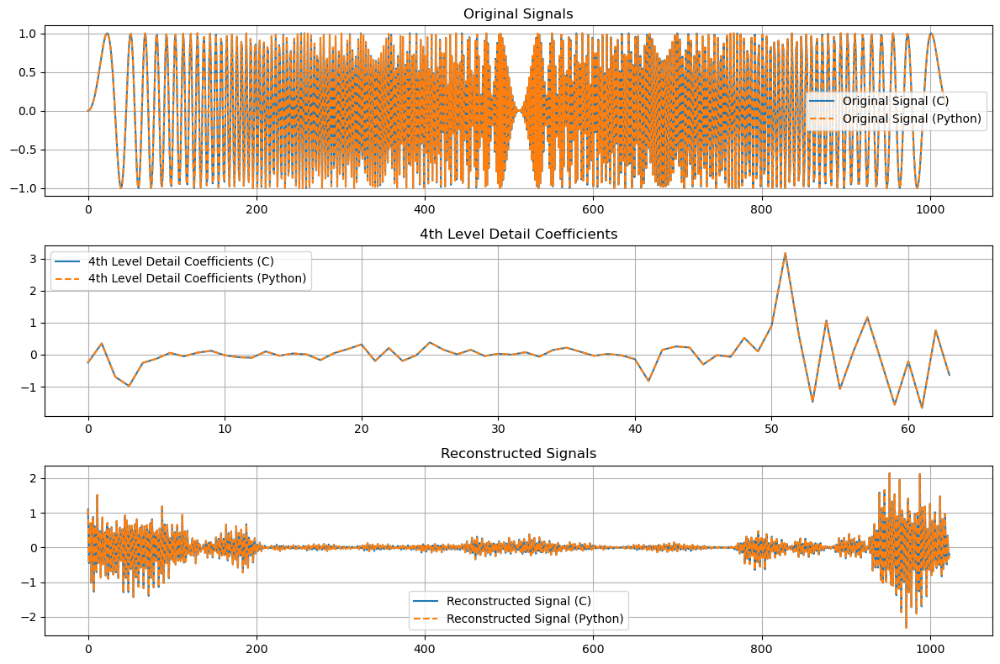

# SUDDEN DAMAGE DETECTION PROGRAMMING

## PIPELINE
- [x] LOAD DATA 
- [x] -> DATA SEGMENTATION 
- [x] -> WAVELET DECOMPOSITION & RECONSTRUCTION 
- [ ] -> INDEPENDENT COMPONENT ANALYSIS 
- [ ] -> FEATURE EXTRACTION & NN CLASSIFICATION

## DATA

## DATA SEGMENTATION
2000 points selected from the original signal data.

for processing, window size = 100, stride = 50

**NOTE:** in Dr Shen's paper, the stride is 1.

## WAVELET DECOMPOSITION & RECONSTRUCTION

### filters
decomposition filters: 2
reconstruction filters: 2

### programming
level 4 decomposition and reconstruction

[cA4, cD4, cD3, cD2, cD1]

[0, **cD4**, 0, 0, 0]

C & Python Comparison

## INDEPENDENT COMPONENT ANALYSIS - (ongoing)

ALGO: FASTICA

I PREPROCESS

I-1 DATA CENTERING

I-2 DATA WHITENING

II ICA

## ICA - ALGORITHM

### 1. Centering the Data - [✅]
Subtract the mean of each row (channel) from each element in that row.

\[
X_{\text{centered}} = X - \text{mean}(X)
\]

### 2. Whitening the Data - [ ]
Whitening transforms the observed signals so that they become uncorrelated and have unit variance.

#### Compute the Covariance Matrix
\[
\text{cov}(X_{\text{centered}})
\]

#### Perform Eigenvalue Decomposition - [BOTTLENECK]
\[
\text{cov}(X_{\text{centered}}) = E \Lambda E^T
\]

**NOTE:** CMSIS + Eigenvalue Decomposition

#### Compute the Whitening Matrix
\[
V = \Lambda^{-\frac{1}{2}} E^T
\]

#### Apply the Whitening Matrix
\[
Z = VX_{\text{centered}}
\]

### 3. FastICA Iteration  - [ ]
#### Initialization
Initialize the de-mixing matrix \( W \) with random values.

\[
W = \text{random}
\]

#### Iterate to Compute \( W \)

##### Compute \( S \)
\[
S = WZ
\]

##### Non-linear Function \( g \)
\[
g(S) = \tanh(\alpha S)
\]

##### Derivative \( g' \)
\[
g'(S) = \alpha (1 - \tanh^2(\alpha S))
\]

##### Update Rule
\[
W_{\text{new}} = \frac{1}{m} \sum_{i=1}^m g(S_i)Z_i^T - \text{diag}\left(\frac{1}{m} \sum_{i=1}^m g'(S_i)\right) W
\]

##### Orthogonalize/Decorrelate \( W \)
\[
W_{\text{new}} = \text{decorrelation}(W_{\text{new}})
\]

##### Convergence Check
\[
\|W_{\text{new}} - W\|_1 < \text{threshold}
\]

### 4. Extract Source Signals
Once the matrix \( W \) has converged, use it to extract the independent components (source signals) from the whitened data.

\[
S = WZ
\]

**NOTE:** WT is fast yet ICA is quite time consuming, we may need a hierarchical approach.

WT -> ICA -> NN

WT -> FEATURES -> NN -> ICA -> FEATURE FILTERING FOR SPIKES
