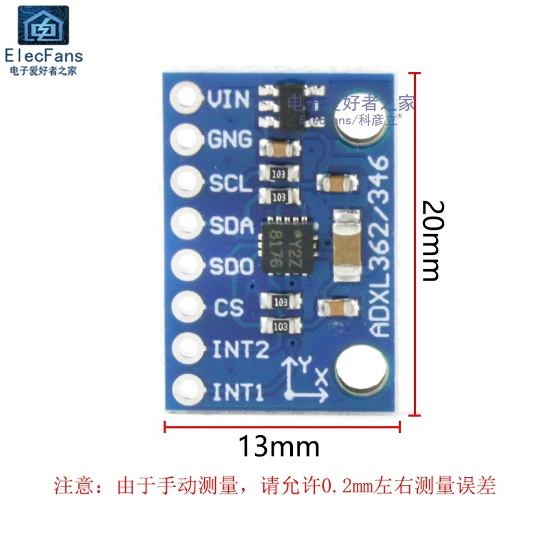

# Weekly Report

## LIFTNODE - STM32 - ACCELEROMETER

### ADXL362
{width=50%}
{width=50%} 
- got some printout but buggy, still debugging
- trying to find suitable drivers for this sensor

### ADXL355
{width=50%}
{width=50%}
- tring to find suitable drivers for this sensor

## MICROPYTHON STUDY
- ESP32 
- STM32

## QE Report