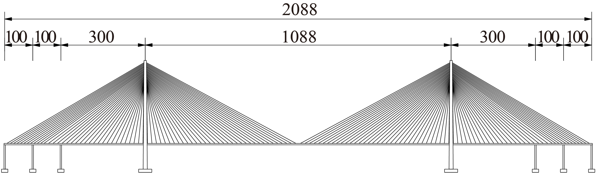
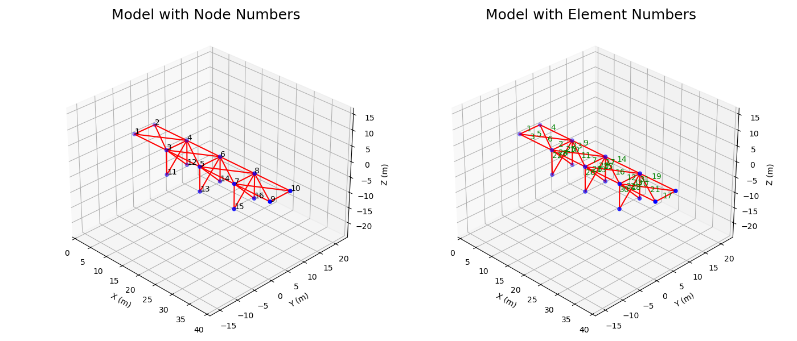

# STM32 VS ESP32

single node to multi-node network

| Feature              | STM32                      | ESP32                         |
|----------------------|----------------------------|-------------------------------|
| Architecture         | ARM Cortex-M               | Xtensa LX6                    |
| Number of Cores      | 1                          | **2**                             |
| Main Frequency       | up to **480MHz**               | up to 240MHz                  |
| Onboard Resources    | **More**                       | Less                          |
| RTOS Support         | Yes, manual integration    | **Yes, integrated by default**    |
| Internet Connectivity| Harder, additional module and config required  | **Easier, bluetooth and wifi integrated by default** |
| DSP support          | **CMSIS-DSP**                  | ESP-DSP                       |
| NN support           | **CMSIS-NN, X-CUBE-AI**        | ESP-DL, ESP-SR, ESP-WHO       |
| DEV Framework        | **STM32Cube**                  | ESP-IDF                       |

try to combine them in future

# OpenSees Model (collaborating with Dr. Zhang Fan)

## Model-1 Sutong Bridge
{width=80%}

- model too big, time consuming, need to simplify
- not easy to simulate damage
- the results may not be applied to timber trestle bridge

## Model-2 Simplified Railway Bridge

- simple
- loading and analyzing
- train-pass loading simulation is quite complex, maybe impact