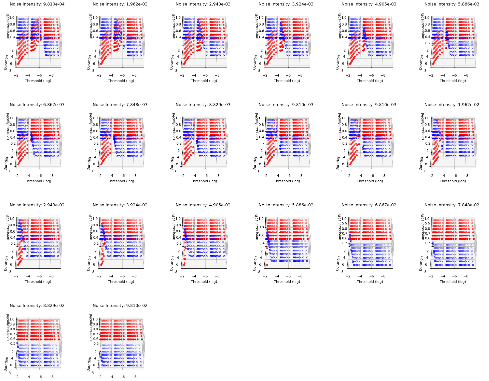

## recall & precision estimation NN - MLP

- different subplots stand for different noise level
- red surface is the recall, blue surface is the precision
- x - threshold (log); y - duration; z - recall/precision

These data are used to train the neural network to estimate the recall and precision of the model.

4200 points in total, 80% for training and validation, 20% for testing.