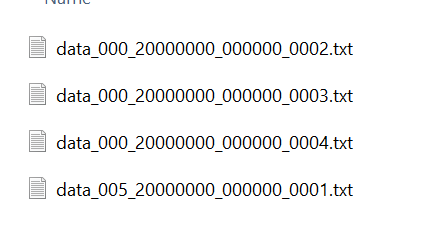
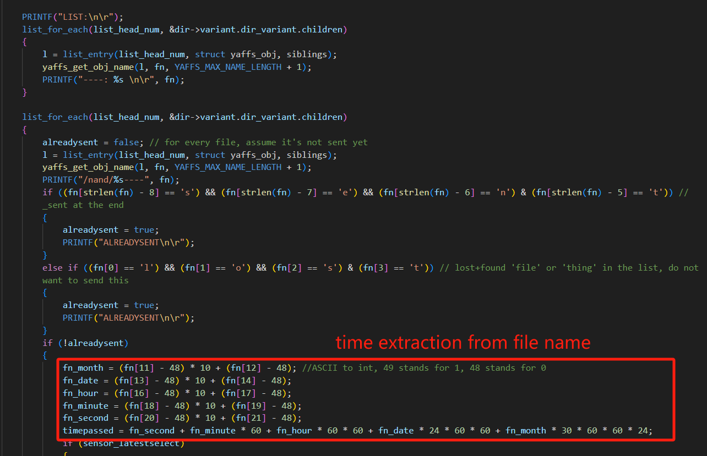
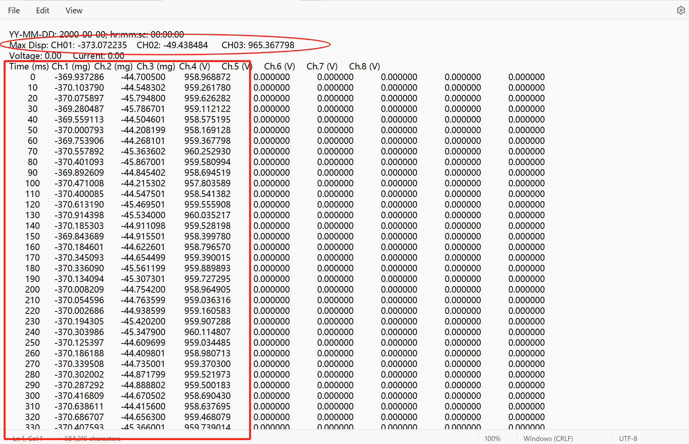
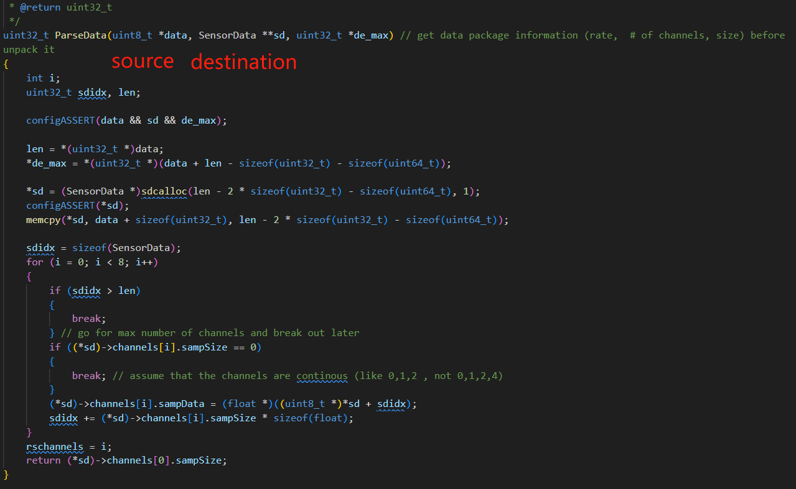
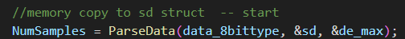
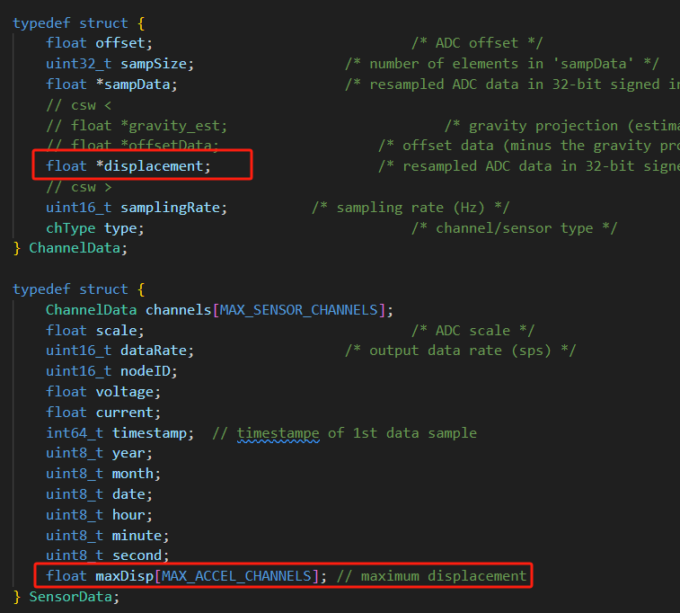

# Xnode

## Time Setup
- Issue: Date and time are not set correctly, all zeros. This might be the cause of the next issue.

- Possible Solution: 
  - Check SD card configuration [x] 
  - Setup time and date manually ?

## Data Inconsistency
- Desired Data Retrieval - the **latest** data
  - **latest**: 
    - corresponding flag is hard coded to **1**
    - date extraction from **file name**
    - **reordering** the files based on date

- Issue:
  - Since the date is not correct, current algorithm can not determine the desired data to fetch

- How I tested:
  - Remote sensing first (0001 in the following graph)
  - Then do data retrieval, during the process, the file was written to the SD card (0002-0004 in the following graph)
  - not the same batch of data.

- Possible Solution:
  - for testing: wipe out the data on nand flash by Nodereset().
  - Correct date setup?

### Parse Data Issue

- Issue:
  - I tried to write down the SensorData parsed from `data_8bittype` - looks incorrect

- Possible Cause:
  - incorrect parse data function

- How to improve the memcpy process?
- 

### Mounting Issues
- In DisplacementEstimation.c, the mounting will lead to an issue - stuck at the funcation
- In DataRetrieval.c, don't know how the data is stored in '\nand'

### Solution

remove max disp from the original SensorData struct

index

reset \nand flash

